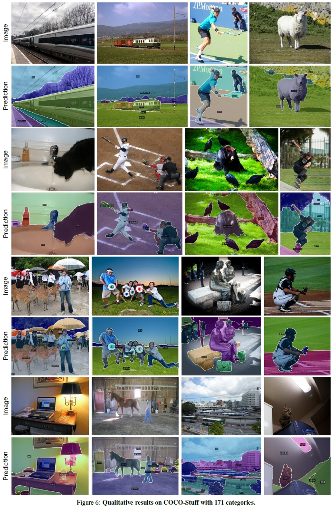

# PAGSeg: Precise Pixel-Level Alignment and Robust Generalization for Open-Vocabulary Segmentation

## Overview
<p align="center">
  
</p >

<p align="center"> The overall architecture of the PAGSeg model. </p >

## 🎆Requirments
- Python==3.8
- numpy==1.23.5
- torch==2.1.0
- tqdm==4.66.5
- wheel==0.44.0
- scipy==1.7.0
- ftfy==6.0.1
- opencv-python==4.5.1.48
- setuptools==59.5.0
- pillow==8.2.0
- imageio==2.4.1
- timm==0.8.3.dev0
- regex
- einops
- detectron

## Implementation Details
 Our implementation is based on the PyTorch and Detectron2 frameworks, using the AdamW optimizer with an initial learning rate of 0.0002 and a weight decay of 0.0001. Our model is trained on 4 NVIDIA A100 GPUs with a batch size of 4 for 80,000 iterations.


## 🤝Result 
<p align="center">
  
</p >

<p align="center">
  
</p >

<p align="center">
  
</p >

## Citation
```python
@inproceedings{
  title={},
  author={},
  booktitle={},
  pages={},
  year={}

}
```